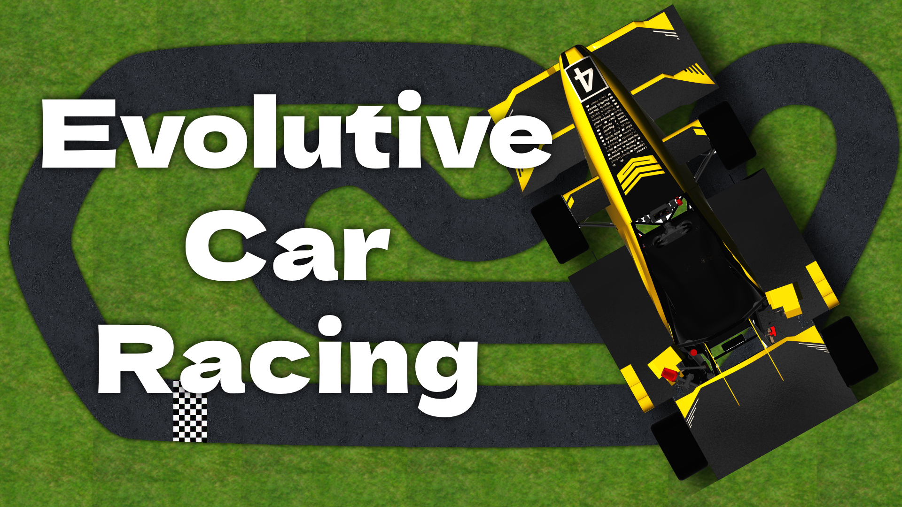
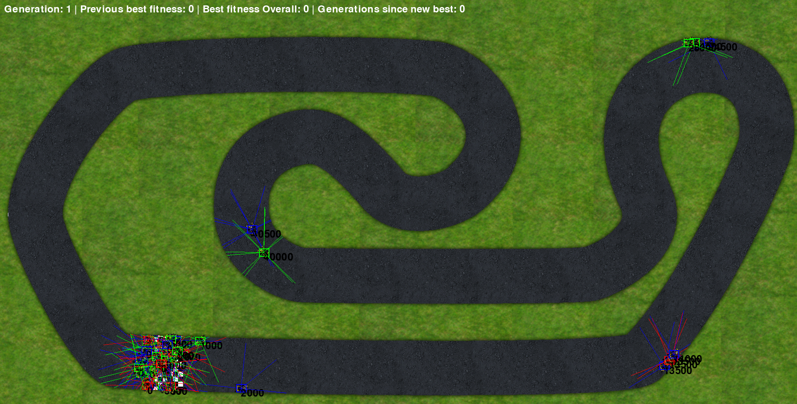

# Evolutive Car Racing!
A video with demonstration and explanation is shown [here](https://youtu.be/P_O1a81Bg1I?si=RuWM24tXJOjyFw7s).
[](https://youtu.be/P_O1a81Bg1I?si=RuWM24tXJOjyFw7s)

### Introduction
This program implements a top-down racing simulator where cars controlled by neural networks, perceptron, compete on a track. It uses genetic algorithms to evolve each car's drivers, allowing them to learn to efficiently navigate the route over multiple generations. Each car is equipped with simulated sensors that provide information about the environment, such as driving distances, and uses these inputs to make decisions about steering, acceleration and braking. The simulation offers an interactive visualization of learning progress, with all cars in the population being simulated and evaluated simultaneously, making the program ideal for exploring concepts of artificial, reinforcement learning and evolutionary intelligence.

### Demonstration
[](https://youtu.be/P_O1a81Bg1I?si=RuWM24tXJOjyFw7s)

### Setup
- Clone the repository
- In order to run this software you will need Python 3.12.3 or later.
- Install the required packages by running the following commands (strongly recommended to use a virtual environment):
```bash
pip install pygame
```
```bash
pip install numpy
```
```bash
pip install opencv-python
```
- Run the scripts, `training.py` if you want to see the cars learning to drive and `game_main.py` if you want to play the game against the best trained car.

### Authors
- Gabriel Franceschi Libardi. NUSP: 11760739
- Gustavo Moura Scarenci de Carvalho Ferreira. NUSP: 12547792
- Matheus Dias Cirillo. NUSP: 12547750
- Lívia Santos Benassi. NUSP: 15470351
- Rafael Perez Carmanhani. NUSP: 15485420.
